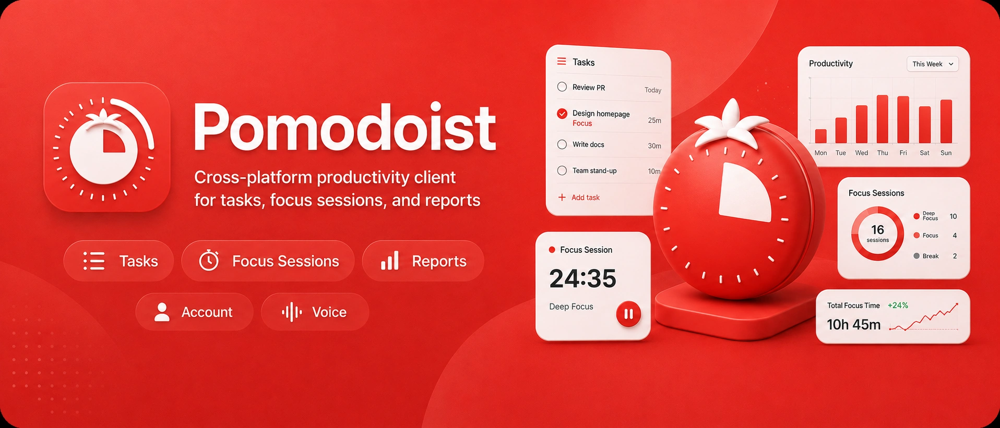
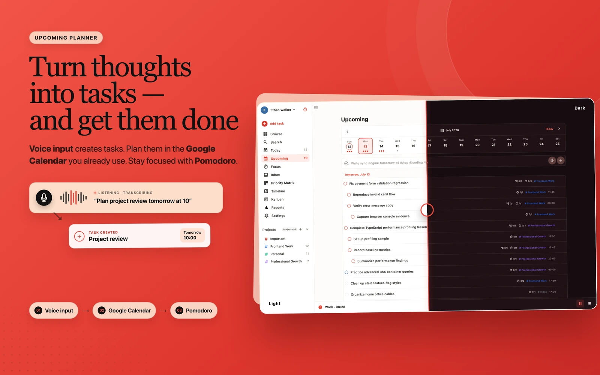
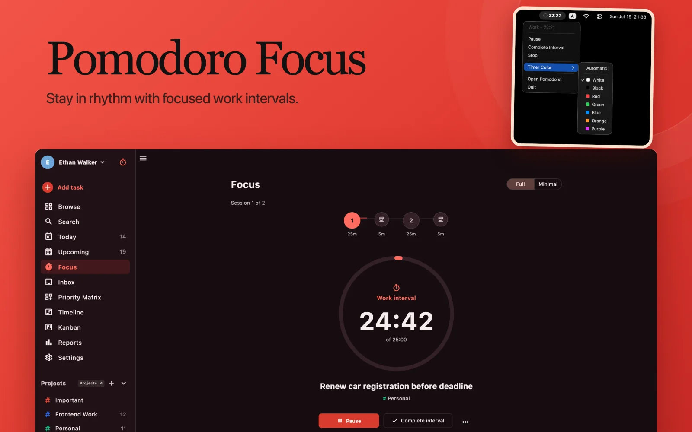
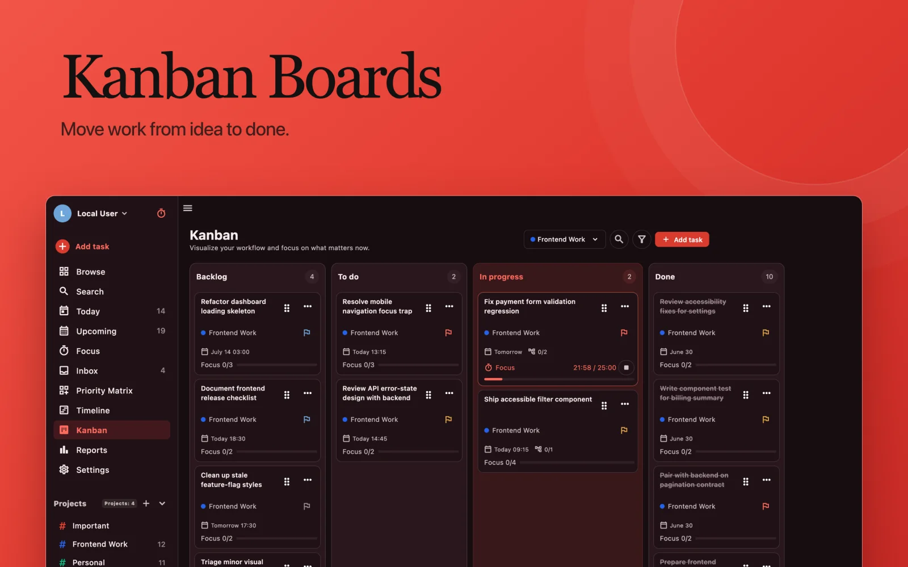
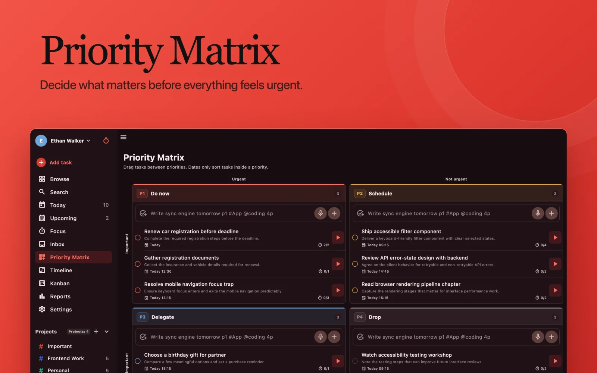
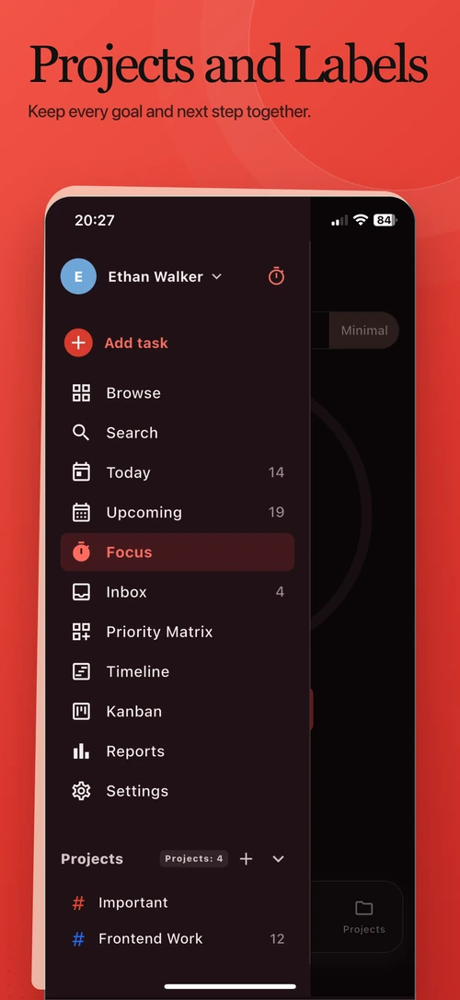
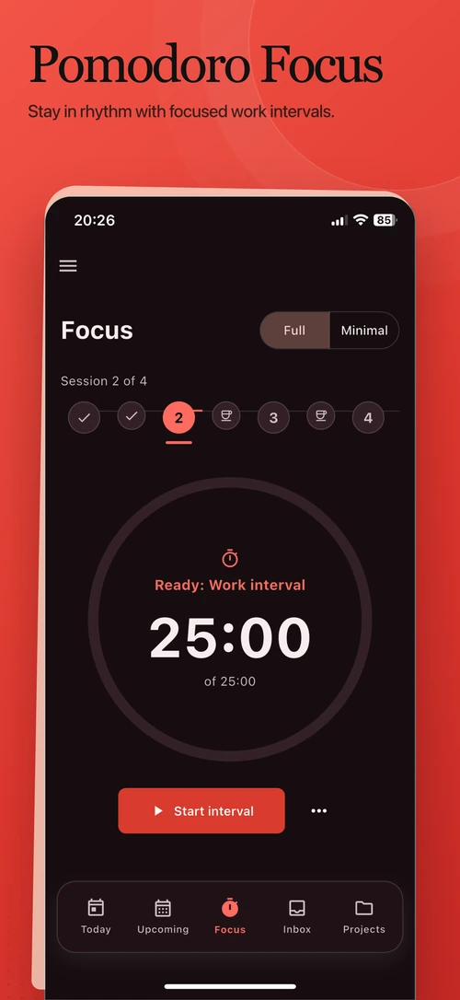
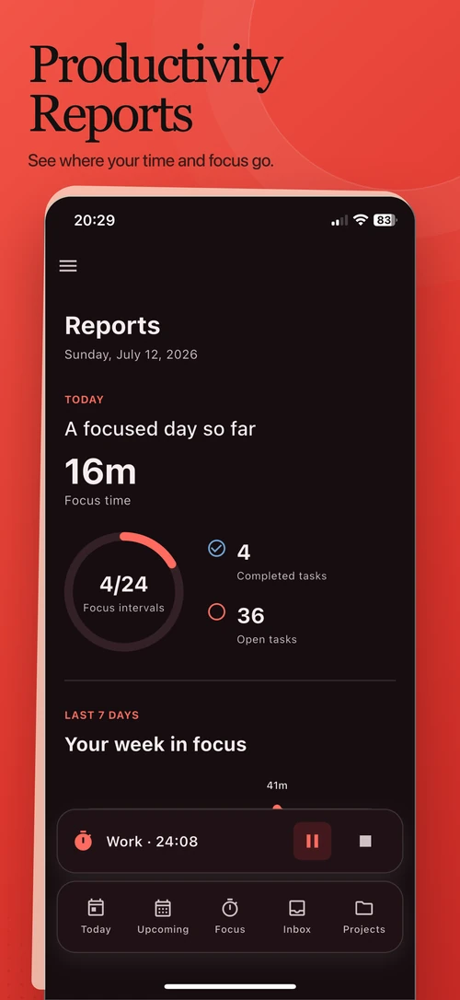
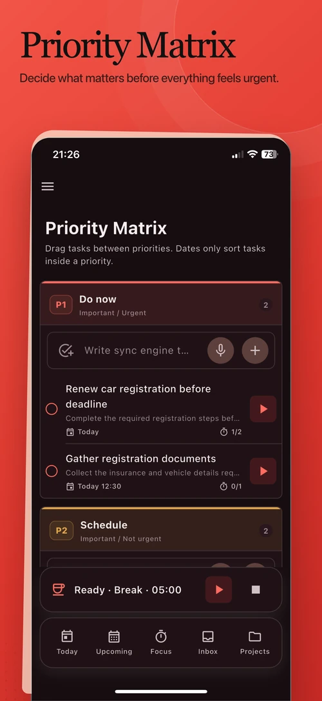
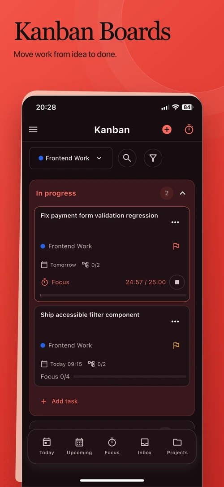

<p align="center">
  
</p>

<h1 align="center">Pomodoist</h1>

<p align="center">
  <strong>An open-source task manager with Pomodoro focus sessions and productivity reports.</strong>
</p>

<p align="center">
  <a href="https://github.com/Kabanya/Pomodoist/actions/workflows/validate.yml"></a>
  <a href="LICENSE"></a>
</p>

<p align="center">
  <a href="https://pomodoist.com">Website</a> ·
  <a href="https://app.pomodoist.com">Try Web</a> ·
  <a href="https://github.com/Kabanya/Pomodoist/releases/latest/download/Pomodoist-x86_64.AppImage">Linux AppImage</a> ·
  <a href="https://github.com/Kabanya/Pomodoist/releases">Desktop Releases</a> ·
  <a href="https://pomodoist.com/privacy/">Privacy</a> ·
  <a href="https://github.com/Kabanya/Pomodoist/issues/new">Report a bug</a> ·
  <a href="CONTRIBUTING.md">Contribute</a>
</p>

Pomodoist brings task planning, protected focus time, and progress tracking
into one Flutter app. Use it on the web or build it for macOS, iOS and iPadOS,
Android, Linux, Windows, and the web.

## Linux AppImage

The x86_64 AppImage is the primary direct Linux download. It is built on
Ubuntu 22.04 for compatibility across current distributions, includes the
Flutter runtime and the GStreamer components used by timer sounds, and does
not require root access or installation:

```sh
curl -LO https://github.com/Kabanya/Pomodoist/releases/latest/download/Pomodoist-x86_64.AppImage
curl -LO https://github.com/Kabanya/Pomodoist/releases/latest/download/Pomodoist-x86_64.AppImage.sha256
sha256sum --check Pomodoist-x86_64.AppImage.sha256
chmod +x Pomodoist-x86_64.AppImage
./Pomodoist-x86_64.AppImage
```

If FUSE is unavailable, run it with
`APPIMAGE_EXTRACT_AND_RUN=1 ./Pomodoist-x86_64.AppImage`. Voice entry is an
optional integration and also needs `parecord` plus `ffmpeg` from the host
distribution. The current Linux notification backend cannot keep scheduled
system notifications alive after Pomodoist exits; focus sounds and in-app
completion feedback work while the app is running.

## Pomodoist at a glance

<p align="center">
  
</p>

- **Plan your work** — organize tasks across inbox, today, upcoming, projects,
  timeline, kanban, priority matrix, and search
- **Protect focus time** — run Pomodoro sessions with deep-focus tracking and
  configurable breaks
- **Review your progress** — understand weekly productivity and focus-time
  trends through built-in reports
- **Work across platforms** — use the same Flutter client on mobile, desktop,
  and web, with optional account, calendar, and voice integrations

## Screenshots

### macOS

<p align="center">
  <a href=".github/assets/screenshots/macos-focus.webp"></a>
  <a href=".github/assets/screenshots/macos-kanban.webp"></a>
  <a href=".github/assets/screenshots/macos-priority-matrix.webp"></a>
  <br>
  <sub>Pomodoro Focus · Kanban Boards · Priority Matrix — click to expand</sub>
</p>

<details>
<summary><strong>Mobile screenshots</strong></summary>

<p align="center">
  
  
  
  <br>
  <sub>Projects · Focus · Reports</sub>
</p>

<p align="center">
  
  
  <br>
  <sub>Priority Matrix · Kanban</sub>
</p>
</details>

## Build from source

Pomodoist is the complete app client, not a stripped-down demo. To run the web
app locally:

```sh
git clone https://github.com/Kabanya/Pomodoist.git
cd Pomodoist
flutter pub get
make web
```

Run the same validation used for contributions:

```sh
make check
```

### Arch Linux

Pomodoist pins Flutter 3.47.0 through FVM so Arch's rolling packages do not
silently change the project toolchain. Install
[`fvm`](https://aur.archlinux.org/packages/fvm) from the AUR, then prepare and
run the native desktop app:

```sh
make setup-linux
make run-linux
```

To build a local AppImage against the libraries on the current Arch system:

```sh
make build-linux-appimage
```

The AppImage and its SHA-256 sidecar are written to
`build/linux/appimage/`. Official cross-distribution release artifacts are
built by CI on the pinned Ubuntu 22.04 base. To instead install the raw
developer bundle for the current user (no root required):

```sh
make install-linux
```

This installs the app under `$XDG_DATA_HOME/pomodoist` (normally
`~/.local/share/pomodoist`), creates `~/.local/bin/pomodoist`, and registers a
desktop launcher and the `pomodoist://` URL scheme. Build dependencies are
checked with `pacman`; if any are missing, `make setup-linux` prints the exact
installation command.

### Windows

For the simplest temporary installation, open the latest GitHub pre-release,
download the single `Pomodoist-Setup.exe` file, and run it. The preview installs
for the current user without administrator access and starts Pomodoist
automatically. Until trusted code signing is enabled, Microsoft Defender
SmartScreen may warn that the publisher is unknown. Verify the adjacent
`Pomodoist-Setup.exe.sha256` file if you want to confirm the download.

Windows development requires Flutter 3.47.0, Visual Studio with Desktop
development with C++, and Windows SDK 10.0.19041.0 or newer.

```powershell
flutter pub get
powershell.exe -NoProfile -ExecutionPolicy Bypass `
  -File .\tool\windows\run.ps1
```

Build a clean release with public production configuration copied from
`tool/windows/production-defines.example.json`:

```powershell
powershell.exe -NoProfile -ExecutionPolicy Bypass `
  -File .\tool\windows\build.ps1 -Configuration Release -Clean `
  -ConfigFile C:\secure\pomodoist-windows-production.json
```

If Visual Studio was upgraded or switched, use `-Clean` once so CMake does not
reuse a generator from the previous installation. Packaging and trusted
signing are performed by the tag-triggered GitHub workflow; public releases
contain `Pomodoist.msixbundle` and `Pomodoist.appinstaller` for Windows 10
2004+ and Windows 11 on x64/ARM64. The unsigned EXE is always marked as a
pre-release and never replaces these stable assets.

<details>
<summary>Develop the shared client packages locally</summary>

The public account and voice packages are pinned to a release commit in
[`Kabanya/app-client-platform`](https://github.com/Kabanya/app-client-platform).
To develop both repositories together, create an ignored
`pubspec_overrides.yaml`:

```yaml
dependency_overrides:
  app_account:
    path: ../app-client-platform/app_account
  app_voice:
    path: ../app-client-platform/app_voice
```
</details>

## Contributing

Bug reports and focused pull requests are welcome. Open an
[issue](https://github.com/Kabanya/Pomodoist/issues/new) before starting a
substantial change, read the [contribution guide](CONTRIBUTING.md), and run
`make check` before submitting a pull request.

## License

Copyright © 2026 FinchForge LLC.

Pomodoist client source and official client binaries are licensed under the
[GNU Affero General Public License v3.0 only](LICENSE) (`AGPL-3.0-only`). See
the [licensing model](LICENSING.md) and
[Code Signing Policy](CODE_SIGNING_POLICY.md). Paid subscriptions cover hosted
services and account entitlements, not a proprietary client license. The name,
logo, and app icon follow the
[trademark policy](TRADEMARKS.md), and contributions require the
[Contributor License Agreement](CLA.md).

## Code signing policy

Free code signing provided by SignPath.io, certificate by SignPath Foundation.
See the public [Code Signing Policy](CODE_SIGNING_POLICY.md), including team
roles, release controls, incident response, and the
[Privacy Policy](https://pomodoist.com/privacy/).
